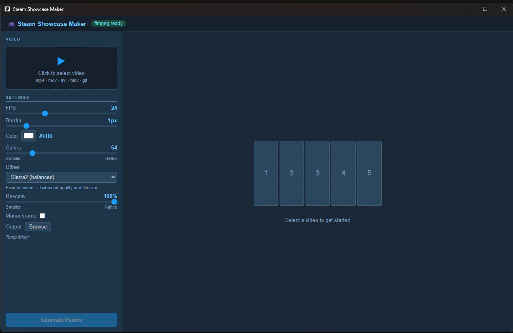
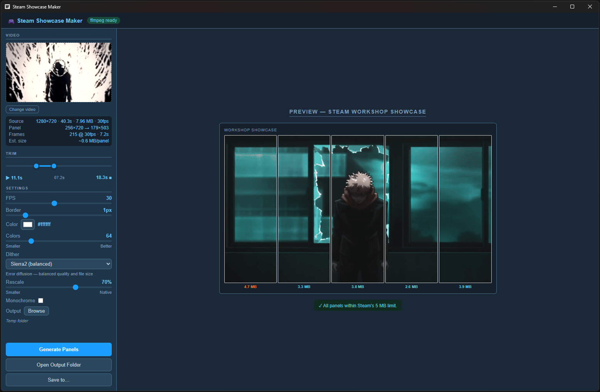

# Steam Showcase Maker

Convert any video into 5 animated GIF panels ready to upload as a Steam Workshop animated showcase — no command line required.





---

## Features

- **Drag-and-drop** or click to load a video (mp4, mov, avi, mkv, webm, gif)
- **Live trim preview** — dual-range slider, video loops the selected clip in real time
- **Fine-grained quality controls** — colors (8–256), four dither algorithms, Bayer scale, rescale (10–100 %)
- **Monochrome mode** — strip color for B&W footage, dramatically smaller palette and file size
- **Live size estimate** — ballpark MB/panel updates as you change every setting
- **Border** — inward border with custom color and width
- **Cancel** mid-generation and kill the ffmpeg process immediately
- **Settings persistence** — FPS, quality, dither, scale, etc. remembered across restarts
- **Save to…** — copy the 5 finished GIFs to any folder after generation
- **Single `.exe`**, no installer — ffmpeg downloads automatically on first launch if not found

---

## Prerequisites

| Requirement | Notes |
|---|---|
| Windows 10 / 11 | WebView2 required — pre-installed on Windows 11; [download for Windows 10](https://developer.microsoft.com/en-us/microsoft-edge/webview2/) |
| ffmpeg + ffprobe | The app will offer to **download automatically** if not found. Or install manually via `winget install ffmpeg` |

### ffmpeg auto-detection

The app checks these locations in order before prompting to download:

```
PATH (system-wide)
%APPDATA%\steam-showcase-maker\bin\  ← app's own download cache
C:\Program Files\ffmpeg\bin\
C:\Program Files (x86)\ffmpeg\bin\
C:\ffmpeg\bin\
```

---

## Quick Start (prebuilt binary)

1. Download `steam-showcase-maker.exe` from the [Releases](../../releases) page
2. Place it anywhere — it is fully self-contained
3. Run it (Windows SmartScreen may warn on first launch → **More info → Run anyway**)
4. If ffmpeg is not installed, click **Download automatically** in the sidebar

---

## Build from Source

### Requirements

- [Go 1.23+](https://go.dev/dl/)
- [Node.js 18+](https://nodejs.org/)
- [Wails v2 CLI](https://wails.io/docs/gettingstarted/installation)

```bash
go install github.com/wailsapp/wails/v2/cmd/wails@latest
```

### Steps

```bash
# Clone
git clone https://github.com/VOiD-Ayush/steam-showcase-maker.git
cd steam-showcase-maker

# Live dev mode with hot-reload
wails dev

# Production build  →  build/bin/steam-showcase-maker.exe
wails build
```

---

## How to Use

### 1 — Load a video

Click the drop area **or drag a video file** directly onto the window.
The sidebar shows native resolution, duration, fps and file size.

### 2 — Trim your clip

Drag the left (▶ start) and right (■ end) handles on the trim slider.
The video preview loops the selected range in real time.

### 3 — Adjust settings

| Setting | Range | What it does |
|---|---|---|
| FPS | 5–60 | Output GIF fps. Auto-capped to source fps and 50 (GIF max). |
| Border width | 0–6 px | Inward border drawn on each panel. |
| Border color | any | Color picker for the border. |
| Colors | 8–256 | GIF palette size. Fewer = smaller file. 32–64 covers most content. |
| Dither | 4 modes | How color transitions are approximated — see table below. |
| Bayer Scale | 0–5 | Grain coarseness when using Bayer dither (0 = fine, 5 = coarse). |
| Rescale | 10–100 % | Downsample the panel before encoding. 50 % cuts file size ~4×. |
| Monochrome | on/off | Strips color — best for B&W or minimal-color footage. |

#### Dither modes

| Mode | File size | Best for |
|---|---|---|
| **None** | Smallest | Pixel art, simple graphics |
| **Bayer** | Small | Animations, logos, fast motion |
| **Sierra2** *(default)* | Balanced | General-purpose |
| **Floyd-Steinberg** | Slightly larger | Photos, complex gradients |

### 4 — Generate

Click **Generate Panels**. Progress bar tracks each of the 5 panels.
Hit **Cancel** at any time to stop immediately.

### 5 — Review and save

The Steam showcase mockup appears with per-panel size badges:

- **Green** — under 4 MB, well within Steam's limit
- **Amber** — 4–5 MB, cutting it close
- **Red ⚠** — over 5 MB, Steam will reject this panel

Click **Save to…** to copy all 5 GIFs to any folder.

### 6 — Upload to Steam

1. Open Steam → navigate to your Workshop item → **Edit**
2. Scroll to **Animated Showcase** → upload each panel in order (`panel_1.gif` … `panel_5.gif`)
3. Save — Steam stitches the 5 panels into a 1920 × 1080 animated banner

---

## Steam Showcase Format

Steam's animated showcase is made of **5 GIFs placed side-by-side** to form a 1920 × 1080 image:

```
┌─────────┬─────────┬─────────┬─────────┬─────────┐
│ panel_1 │ panel_2 │ panel_3 │ panel_4 │ panel_5 │
└─────────┴─────────┴─────────┴─────────┴─────────┘
                  ←── 1920 px total ──→
```

Each panel must be **under 5 MB** (Steam hard limit).

The app automatically:
- Crops each fifth of the frame at native resolution (no upscaling)
- Two-pass palette generation (`palettegen` → `paletteuse`) for optimal color mapping
- `+offsetting` GIF flag — only encodes changed pixels per frame
- Last-byte patch (`0x21`) — required for Steam to accept the GIF upload

---

## Tips for Staying Under 5 MB

| Lever | Typical impact |
|---|---|
| Lower FPS (30 → 10) | ~3× smaller |
| Rescale 75 % | ~2× smaller |
| Rescale 50 % | ~4× smaller |
| Fewer colors (128 → 32) | ~25 % smaller |
| Monochrome | ~40 % smaller |
| Shorter clip | proportional |

The **Est. size** indicator in the sidebar updates live as you adjust settings.

---

## Project Structure

```
steam-showcase-maker/
├── app.go              # Go backend — ffmpeg pipeline, settings persistence, file I/O
├── main.go             # Wails entry point + local file serving middleware
├── hide_windows.go     # Windows: suppress console windows from child processes
├── hide_other.go       # Non-Windows stub
├── frontend/
│   └── src/
│       ├── App.svelte  # Full UI — sidebar controls, preview, results
│       └── style.css   # Steam dark theme
└── build/bin/          # Output binary (git-ignored)
```

---

## Credits

### Inspiration

Huge thanks to **[Easy Boink (@EasyBoink)](https://www.youtube.com/@EasyBoink)** — his tutorial
[**"How to make an animated Steam Workshop showcase"**](https://www.youtube.com/watch?v=aqlfQq1PCAw)
explained the entire technique: the five-panel split, two-pass GIF encoding, the hex-patch trick, and the Steam upload workflow.

This application exists to make that process accessible to everyone without touching the command line.

### Built with

- [Wails v2](https://wails.io/) — Go + WebView2 desktop framework
- [Svelte](https://svelte.dev/) — reactive UI
- [ffmpeg](https://ffmpeg.org/) — video processing and GIF encoding

---

## License

MIT — see [LICENSE](LICENSE) for details.
